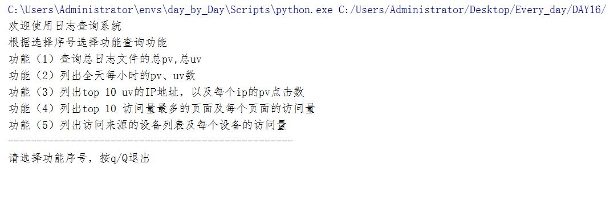
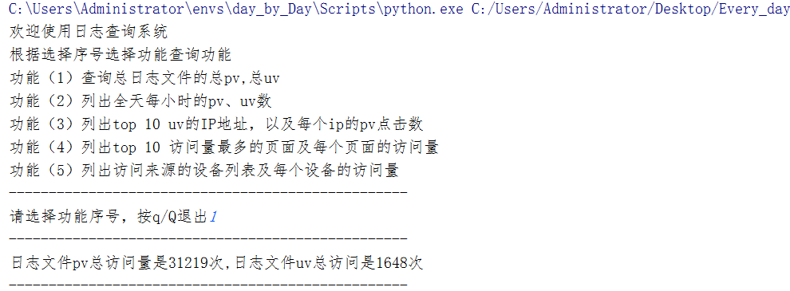
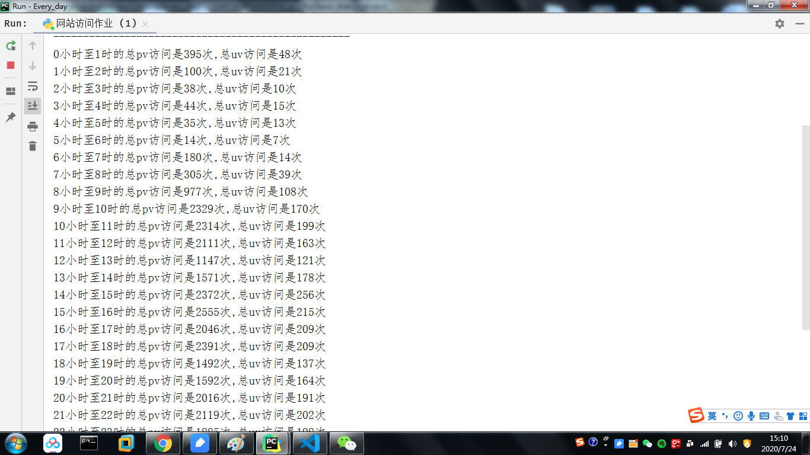
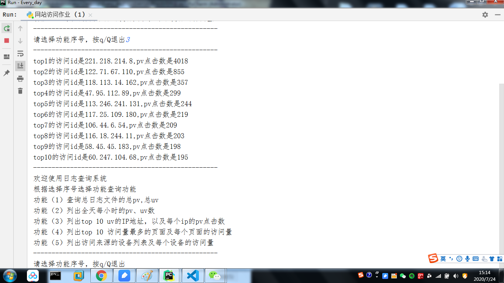
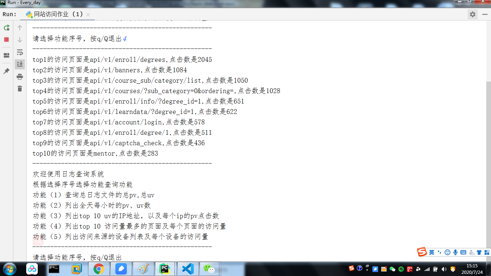
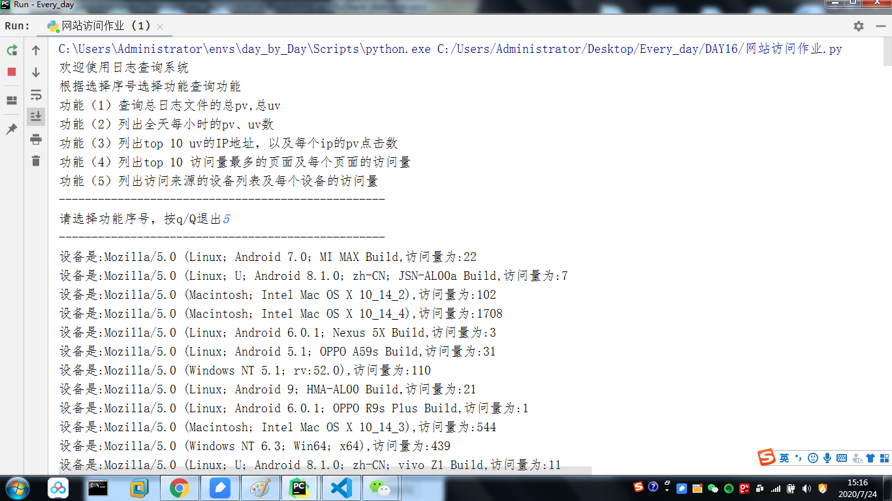

## 程序功能：
- **1: 查询日志文件的总pv，uv**
- **2: 查询每个小时的pv,uv**
- **3: 查询top 10 pv,uv的IP地址,以及每个ip的pv点击数**
- **4: 获取top 10                     访问量最多的页面及每个页面的访问量**

- **5: 获取访问来源的设备列表及每个设备访问量**

---

## 程序的启动方式：
- python  网站查询作业.py
- pycharm 运行
 

---

## 使用模块:
- time 模块
- copy 模块
- re 模块  
---

## 环境配置：
- python 3.6
- pip	20.1.1	
- setuptools	47.1.1	
- wheel	0.34.2	
## 常见问题：
**1. 正则匹配问题**
- 在线调试后，调用re模块匹配文件数据
- [在线正则工具网址](https://regex101.com/)

---

**2. 查询日志文件的top 10问题** 
- 导入copy模块，调用copy.deepcopy函数
- 遍历原字典，删除新字典，获取最大值保存在列表中

```
def catch_num_top(num, dic):
	'''
	返回一个字段的top 10 的列表
	:param num: 取值
	:param dic: {ip：max_num}次数
	:return: list 类型 元素为 （字段，max_num）
	'''
	count = 0  # 创建变量count用来计数 
	lis = []
	while count < num:
		dic2 = copy.deepcopy(dic)  # 深拷贝避免内存地址相同
		for k, v in dic.items():
			if v == max(dic.values()):
				max_num = dic2.pop(k)
				lis.append((k, max_num))
		dic = dic2
		count += 1
	return lis

```

---

**3. 查询字段与对应次数的问题**
- 编写函数，采用数据类型为dict来保存查询字段与相应次数的关系


```
def get_top_dic(gruop_num):
	'''
	获取一个字典字段为正则组别与对应的次数
	:param gruop_num: 正则分组的组别
	:return:返回一个dict类型
	'''
	ret = read_data()
	lis = []
	dic = {}
	for i in ret:
		lis.append(i.group(gruop_num))
	s = set(lis)
	for x in s:
		v = lis.count(x)
		dic[x] = v
	return dic

```

---

**4. 时间格式替换问题**
- 编写函数导入模块time模块解决

```
def get_pv_hour():
	'''
	得到一个列表，以元组形式包含pv与hour
	:return:list 返回一个列表元素为pv和时间组成的元组
	'''
	lis = []
	month_dic = {'Jan': '1', 'Feb': '2', 'Mar': '3', 'Apr': '4', 'May': '5', 'Jun': '6', 'Jul': '7', 'Aug': '8','Sept': '9', 'Oct': '10', 'Nov': '11', 'Dec': '12'}
	ret = read_data()
	for i in ret:
		old_mouth_str = re.search(r'[A-Za-z]{3,}', i.group(2))[0]
		mouth_str = month_dic.get(old_mouth_str)
		new_mouth_str = i.group(2).replace(old_mouth_str, mouth_str)
		t = time.strptime(new_mouth_str, '%d/%m/%Y:%H:%M:%S')  # 将字符串转化为时间元组形式
		t_hour = t.tm_hour  # 获取每个pv的小时
		lis.append((i, t_hour))
	return lis

```

---
## 图片示例：
**程序查询接口:**

---
**日志文件总pv,uv:**

---
**全天每小时的pv、uv数:**

---
**top 10id地址和访问数量:**

---
**top 10访问页面，及其访问量:**

---
**设备及其访问量:**

